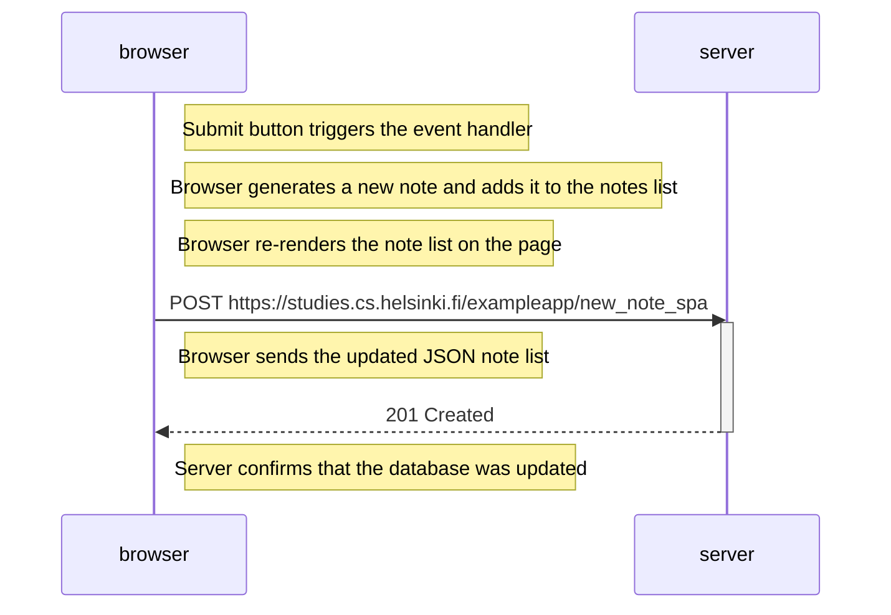

```mermaid
sequenceDiagram
    participant browser
    participant server

    Note right of browser: Submit button triggers the event handler

    Note right of browser: Browser generates a new note and adds it to the notes list
    
    Note right of browser: Browser re-renders the note list on the page
    
    browser->>server: POST https://studies.cs.helsinki.fi/exampleapp/new_note_spa
    activate server
    
    Note right of browser: Browser sends the updated JSON note list
    
    server-->>browser: 201 Created
    deactivate server
    
    Note right of browser: Server confirms that the database was updated

```